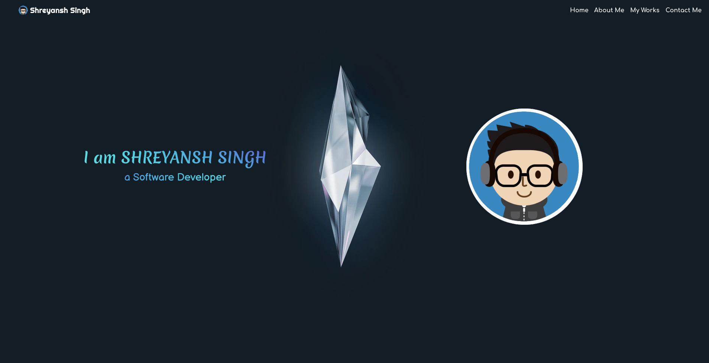
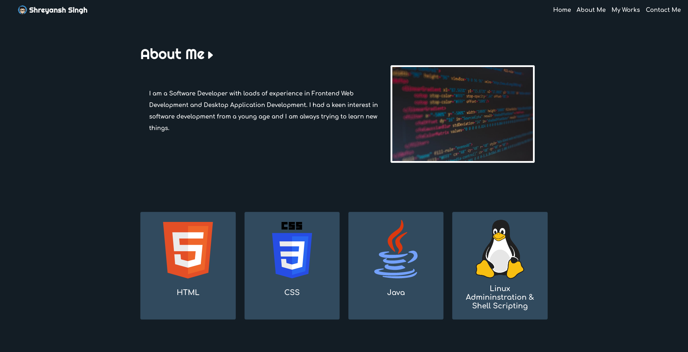
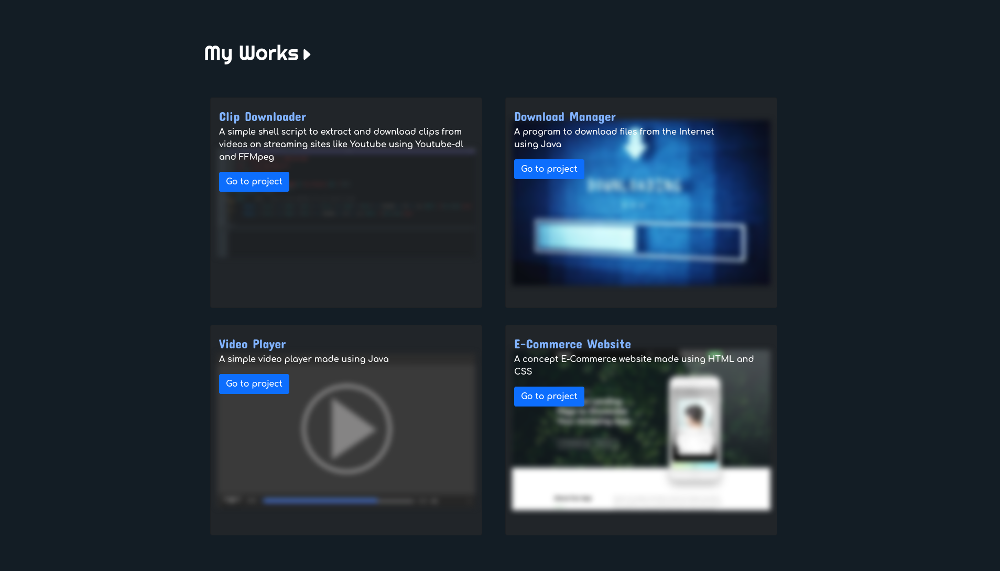
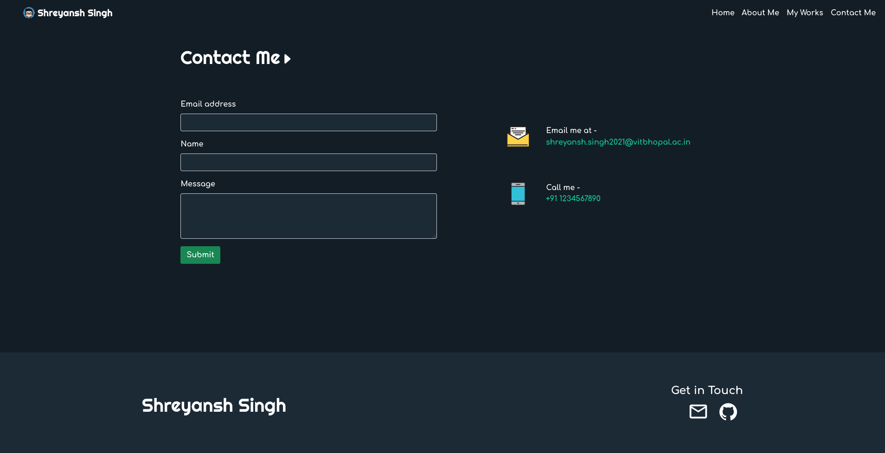

# Portfolio Website

Website created for the competition organised by the Bit-by-Bit Community of VIT Bhopal.  

# Information

**Name -** Shreyansh Singh  
**Registration No. -** 21BCE10379

# Screenshots

### Home

### About Me

### My Works

### Contact Me

# Credits

- [Bootstrap.](https://getbootstrap.com/)
- Ian Lunn's [Hover.css](https://github.com/IanLunn/Hover/) - for CSS animations.
- [SVGRepo](https://www.svgrepo.com/), [Unsplash](https://unsplash.com/) and [Pinclipart](https://www.pinclipart.com) - For images and icons.
- [Google Fonts](https://fonts.google.com/) and [Google Fonts WebHelper](https://google-webfonts-helper.herokuapp.com/fonts) - For the fonts.